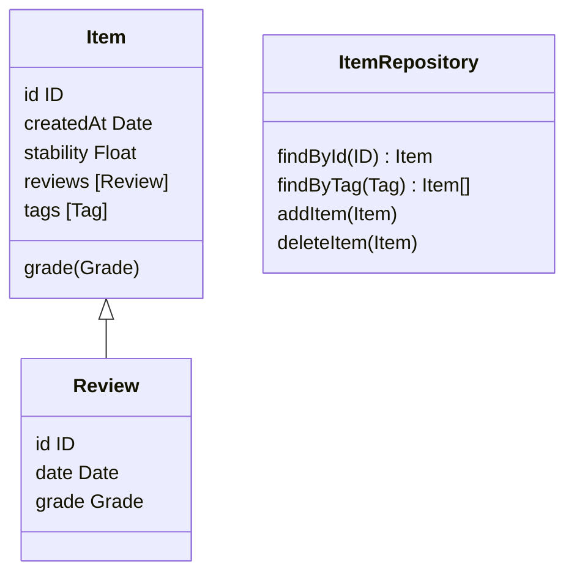

# Memory Service
Microservice Api that handles item memorization and  provides spaced repetition features.

> ⚠️ To display the graph below you need the 'mermaid' extension

## Endpoints
### Get item by id
`GET items/:id`

**Response**
- `200 OK` - Returns the item
- `404 Not Found` - Item not found

### Get items by tag
`GET items/?tag=:tag`

|**Params**|Type| Default|
|----------|----|--------|
| limit    | Int|   10   |
| offset | Int | 0 |
| toReview | Boolean | false |

**Response**
- `200 OK` - Returns the items (or empty array if no items found)

### Grade an item
`PUT items/:id/grade`

**Request body**
|Name| Type | Default|Required|
|----|------|--------|-----|
|grade| Float | none | yes
|date| Date | Current date | no|

**Response**
- `200 OK` - Returns the updated item
- `400 Bad request` - If grade is not a float

### Add new item
`POST items/`

**Request body**
|Name| Type | Default|Required|
|----|------|--------|-----|
|tags| String array | none | yes|
|createdAt| Date | Current date | no

**Response**
- `201 Created` - Returns the created item
- `400 Bad request` - If tags are not present

### Delete item
`DELETE items/:id`

**Response**
- `204 No Content` - Item deleted
- `404 Not Found` - Item not found
